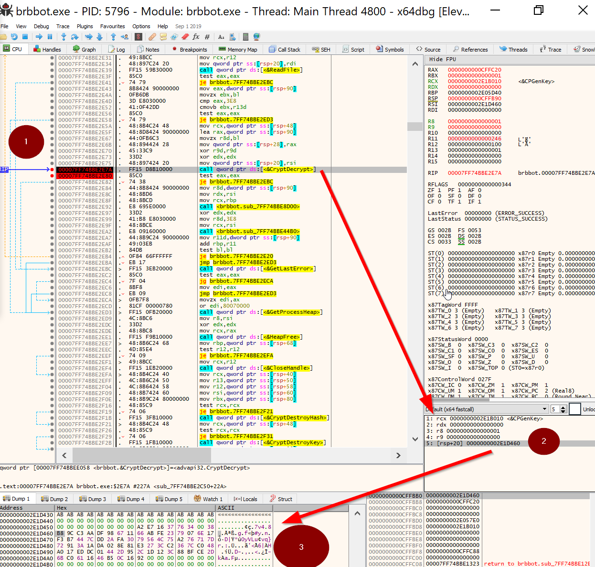

## Reversing BRBBOT malware

lessons learned:
#Post  

- For Windows x64 binaries, setting a breakpoint on a function call, it's possible to derive the arguments being passed using the "fastcall" convention

  - in this convention, registers should be used for the first 4 arguments with the stack frame used for subsequent arguments
    [details from Microsoft](https://docs.microsoft.com/en-us/cpp/build/x64-software-conventions?view=vs-2019)

  - in x64dbg, this is represented as follows:
    

  1. The line at which execution is paused by our breakpoint. We can see [CryptDecrypt](https://docs.microsoft.com/en-us/windows/win32/api/wincrypt/nf-wincrypt-cryptdecrypt) is being called
     at this step.

  2. Here we see the arguments being passed to CryptDecrypt, each argument in it's own register or stack frame.
     Per the CryptDecrypt documentation, the fifth parameter (at RSP+20) points to the location in memory with the data to be decrypted.

  3. This is the encrypted data at that memory location stored in RSP+20

- Some malware may pull results of function calls from memory using memcpy. SetBPX memcpy and checking register contents on calls can net useful intelligence on its behavior
- Calls to CryptDecrypt typically precede interesting intel, while calls to CryptEncrypt precede interesting intel

# Analyzing BRBBOT

We load brbbot.exe into ghidra, being sure to select "propagate external parameters" during import. This increases the amount of hints/comments Ghidra labels the code with.

Upon loading, one of the best places to start is by looking at the Symbol Table in order to find interesting function calls. Upon finding those function calls, we can open a debugger (x64dbg) and set breakpoints in the vicinity of those calls.

For brbbot, some of the interesting function calls are:

- Crypto:
  - CryptEncrypt
  - CryptDecrypt
- Filesystem:
  - CreateFileA
  - WriteFile
  - ReadFile
- Process Management
  - CreateProcessA
- Enumeration
  - GetStartupInfoW
  - GetEnvironmentVariableA
- Networking
  - HttpOpenRequestA
  - HttpSendRequestA
  - HttpQueryInfoA
  - WSAStartup: starts Winsock (handles access to Windows TCP/IP stack)
