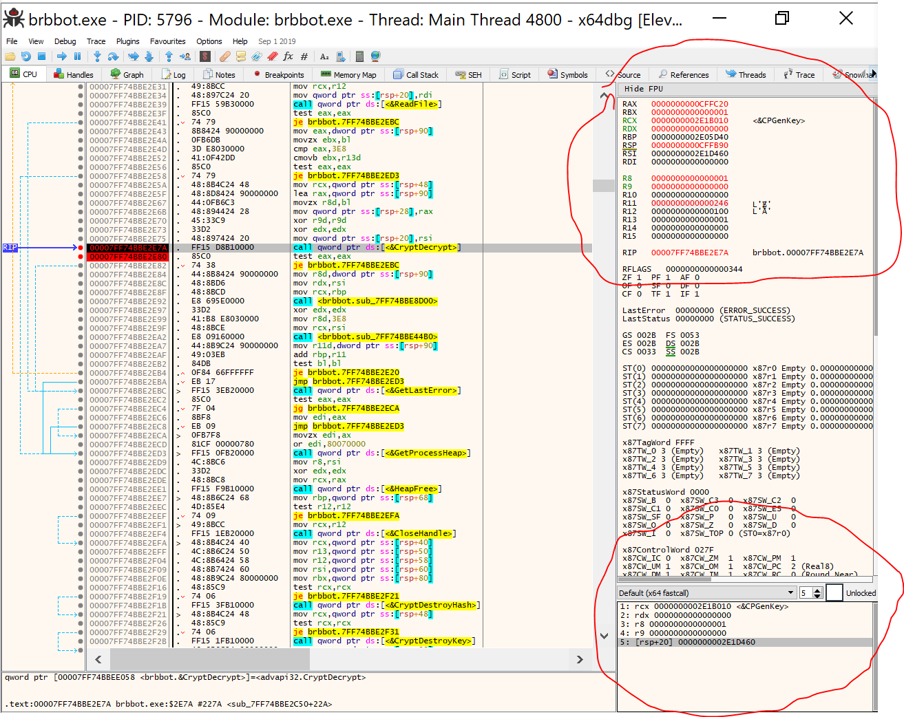

## Reversing BRBBOT malware

lessons learned:
For Windows x64 binaries, setting a breakpoint on a function call, it's possible to derive the arguments being passed using the "fastcall" convention.  
The convention states registers should be used for the first 4 arguments, and the stack frame for subsequent arguments
See following for details:https://docs.microsoft.com/en-us/cpp/build/x64-software-conventions?view=vs-2019

in x64dbg, this is represented as follows:
.
